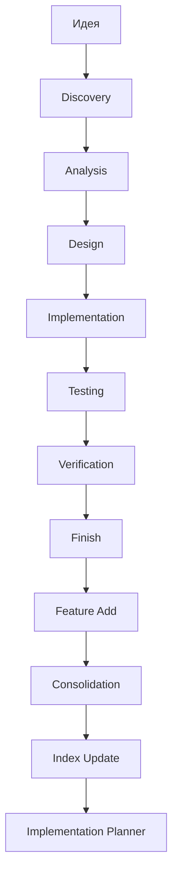

## AI Prompt System в CodeShift: Полный обзор

### Что это такое?

**AI Prompt System** — это комплексная система управления AI-промптами для автоматизации архитектурных решений (ADR), верификации кода и управления жизненным циклом проекта. Это не просто набор промптов, а полноценная **MCP-сервисная архитектура** с полным циклом управления.

### Ключевые компоненты системы

#### 1. **Meta-промпты (Управление системой)**
- [`meta-promt-adr-system-generator.md`](docs/ai-agent-prompts/meta-promptness/meta-promt-adr-system-generator.md) — **Source of Truth**, конституция всей системы
- [`meta-prompt-generation.md`](docs/ai-agent-prompts/meta-promptness/meta-prompt-prompt-generation.md) — фабрика CodeShift-специфичных промптов
- [`meta-promt-universal-prompt-generator.md`](docs/ai-agent-prompts/meta-promptness/meta-promt-universal-prompt-generator.md) — фабрика универсальных промптов

#### 2. **Операционные промпты (Рабочие задачи)**
33+ специализированных промптов для разных сценариев:
- ADR управление: [`promt-verification.md`](docs/ai-agent-prompts/promt-verification.md), [`promt-feature-add.md`](docs/ai-agent-prompts/promt-feature-add.md)
- Код верификация: [`promt-bug-fix.md`](docs/ai-agent-prompts/promt-bug-fix.md), [`promt-refactoring.md`](docs/ai-agent-prompts/promt-refactoring.md)
- Инфраструктура: [`promt-ci-cd-pipeline.md`](docs/ai-agent-prompts/promt-ci-cd-pipeline.md)
- Документация: [`promt-documentation-refactoring-standards-2026.md`](docs/ai-agent-prompts/promt-documentation-refactoring-standards-2026.md)

#### 3. **Pipeline ADR (Конвейер архитектурных решений)**
Система управляет полным циклом ADR через специализированные промпты:



### Как это работает в CodeShift

#### 1. **Интеграция через Git Submodule**
```bash
git submodule add https://github.com/your-org/ai-agent-prompts.git docs/ai-agent-prompts
```
- Изоляция от основного репозитория
- Контроль версий
- Независимость для разных проектов

#### 2. **Prompt Factory (Цепочка генерации)**
Система использует 7-этапную цепочку для превращения идеи в реализацию:

| Этап | Промпт | Назначение |
|------|--------|-----------|
| **IDEATION** | `promt-ideation.md` | Генерация идей с оценками |
| **ANALYSIS** | `promt-analysis.md` | Анализ требований и рисков |
| **DESIGN** | `promt-design.md` | Архитектура и проектирование |
| **IMPLEMENTATION** | `promt-implementation.md` | Генерация кода |
| **TESTING** | `promt-testing.md` | Тестирование и валидация |
| **DEBUGGING** | `promt-debugging.md` | Self-correction |
| **FINISH** | `promt-finish.md` | Документация и delivery |

#### 3. **MCP Архитектура (FastMCP Server)**
```python
# server.py
from fastmcp import FastMCP

mcp = FastMCP("AI Prompt System")

@mcp.tool
def run_prompt(prompt_name: str, input_data: dict) -> dict:
    """Execute a single prompt"""
    prompt = load_prompt(f"prompts/{prompt_name}.md")
    result = fill_and_execute(prompt, input_data)
    return {"status": "success", "output": result}

@mcp.tool
def run_prompt_chain(idea: str, stages: list[str]) -> dict:
    """Execute full chain: idea → finish"""
    return run_chain(idea, stages)
```

### Как это полезно для любых проектов

#### 1. **Universal Prompts (Project-Agnostic)**
Система включает универсальные промпты, которые работают с ЛЮБЫМИ проектами:

- [`promt-project-stack-dump.md`](docs/ai-agent-prompts/promt-project-stack-dump.md) — быстрый анализ любого проекта
- [`promt-mvp-baseline-generator-universal.md`](docs/ai-agent-prompts/promt-mvp-baseline-generator-universal.md) — генерация MVP для любого стека
- [`promt-project-adaptation.md`](docs/ai-agent-prompts/promt-project-adaptation.md) — адаптация под любой проект

#### 2. **Качество и Валидация**
- **Quality Gates A-H** — 8-точечная система проверки качества промптов
- **Self-verification** — автоматическая проверка output-а
- **CI/CD интеграция** — автоматические тесты в GitHub Actions

#### 3. **Масштабируемость**
- **Multi-tenant** — изоляция проектов через API keys
- **Hybrid Storage** — Redis + PostgreSQL для разных типов данных
- **Versioning** — полное версионирование промтов

### Пример использования в любом проекте

```bash
# 1. Быстрый старт с новым проектом
cat docs/ai-agent-prompts/promt-project-stack-dump.md | \
  ai "Проанализируй мой проект и дай полный статус"

# 2. Генерация MVP для любого проекта
cat docs/ai-agent-prompts/promt-mvp-baseline-generator-universal.md | \
  ai "Сгенерируй MVP для моего React/Node.js проекта"

# 3. Адаптация под конкретный проект
cat docs/ai-agent-prompts/promt-project-adaptation.md | \
  ai "Адаптируй меня под мой проект по файлу MVP.md"
```

### Преимущества системы

1. **Стандартизация** — единые правила для всех промптов
2. **Качество** — автоматическая проверка через Quality Gates
3. **Масштабируемость** — работает от малого проекта до enterprise
4. **Универсальность** — промпты работают с любым стеком технологий
5. **Автоматизация** — полный цикл от идеи до реализации
6. **Верификация** — постоянная проверка соответствия ADR и кода

### Интеграция с CodeShift

В CodeShift система используется для:
- Управления ADR через специализированные промпты
- Верификации соответствия архитектурных решений и кода
- Автоматического обновления документации
- CI/CD интеграции для качества кода
- Онбординга новых разработчиков

Эта система превращает AI-промпты из простых шаблонов в полноценную **управляемую архитектуру** с полным циклом жизни, качеством и масштабируемостью.